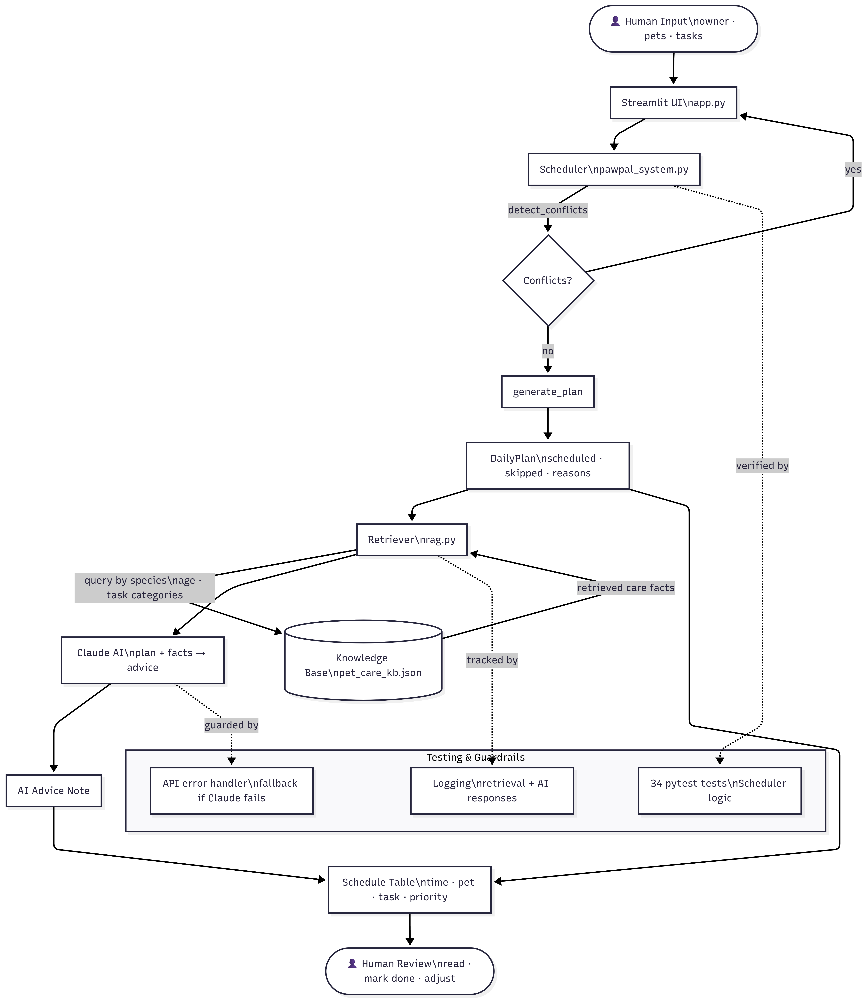

# PawPal+ Applied AI System

## Video Walkthrough

[Watch the Loom walkthrough](https://www.loom.com/share/792c52a5455748cf88958afeba1dfea9)

---

## Portfolio Reflection

This project shows that I approach AI engineering as a systems problem, not just a prompting problem. I built a deterministic scheduling layer first, covered it with 62 automated tests, and only then added the AI layer — so the AI has a solid foundation to sit on. When the RAG pipeline produced wrong output (medication advice for every schedule), I diagnosed it at the retrieval level rather than blaming the model. When the app crashed on a missing file, I added a graceful fallback rather than assuming the file would always be there. That discipline — understanding what breaks, why it breaks, and fixing the root cause — is what I bring to AI engineering work.

---

## Summary

PawPal+ is a pet care scheduling assistant that combines rule-based planning with Retrieval-Augmented Generation (RAG) to give owners personalised, breed-aware advice alongside their daily schedule. Instead of returning a generic AI response, it retrieves specific care facts from a local knowledge base and grounds every piece of advice in those facts — so the output is relevant to the actual pet, age group, and tasks in the schedule.

This matters because busy pet owners don't need another chatbot telling them dogs need exercise. They need a tool that looks at their specific schedule, knows their pet is a 2-year-old rabbit, and says something useful about what to prioritise today.

---

## Original Project

**PawPal+** was first built in Modules 1–3 of AI 110 as a pure Python / Streamlit scheduling app with no AI layer. Its original goals were to help busy pet owners track care tasks, fit them into a daily time budget using a priority-first greedy algorithm, detect scheduling conflicts, and automatically reschedule recurring tasks. Every decision was deterministic and rule-based — the app made no calls to any external model.

This repository extends that foundation by adding a RAG pipeline so the generated schedule is accompanied by care advice grounded in a pet-specific knowledge base.

---

## System Diagram



---

## Architecture Overview

The system has three layers that run in sequence each time the owner generates a schedule:

1. **Scheduler** (`pawpal_system.py`) — collects every task across all pets, sorts by priority then duration, and fits tasks into the owner's available time budget. It also detects time-slot conflicts and handles recurring task rescheduling. This layer is entirely deterministic and covered by 34 automated tests.

2. **RAG pipeline** (`rag.py`) — after the plan is built, the Retriever queries `pet_care_kb.json` using the pet's species, age group, and task categories as search keys. The retrieved facts are passed to **Groq (Llama 3.1 8B Instant)** alongside the generated plan. The model returns a short, grounded advice note anchored to the specific facts that were looked up — not a generic response.

3. **Streamlit UI** (`app.py`) — the owner interacts with both layers through a single web interface: setup → add tasks → conflict check → generate schedule → edit schedule → AI advice note.

Human review happens at two points: when the owner reads the schedule and decides whether to follow it, and when the owner reads the AI note and judges whether the advice applies to their specific pet.

---

## Setup Instructions 

### Prerequisites

- Python 3.10 or higher
- A free Groq API key — get one at [console.groq.com](https://console.groq.com)

### Steps

```bash
# 1. Clone the repo
git clone https://github.com/Omar-Adham/pawpal-applied-ai-system
cd pawpal-applied-ai-system

# 2. Create and activate a virtual environment
python -m venv .venv

# macOS / Linux:
source .venv/bin/activate
# Windows:
.venv\Scripts\activate

# 3. Install dependencies
pip install -r requirements.txt

# 4. Add your Groq API key
# Create a .env file in the project root:
echo GROQ_API_KEY=your-key-here > .env

# 5. Run the app
streamlit run app.py

# 6. (Optional) Run the terminal demo — no browser needed
python main.py

# 7. (Optional) Run the test suite
python -m pytest tests/test_pawpal.py -v
```

---

## Sample Interactions

### 1 — Conflict detected before scheduling

**Input:** Two tasks assigned the same start time.

| Pet | Task | Time | Duration | Priority |
|---|---|---|---|---|
| Biscuit (Dog) | Morning Walk | 07:00 | 30 min | HIGH |
| Luna (Cat) | Thyroid Meds | 07:00 | 5 min | HIGH |

**Output (conflict check):**

```
⚠ 1 scheduling conflict found.
Conflict at 07:00 — Biscuit:Morning Walk, Luna:Thyroid Meds
Tip: edit one task's scheduled time to resolve the conflict.
```

---

### 2 — Daily schedule generated with a skipped task

**Input:** Owner (Jordan) has 60 minutes available. Pet: Mochi, 2-year-old dog.

| Task | Category | Time | Duration | Priority | Frequency |
|---|---|---|---|---|---|
| Morning Walk | walk | 07:00 | 30 min | HIGH | daily |
| Breakfast | feed | 08:00 | 10 min | HIGH | daily |
| Fetch Session | enrichment | 15:00 | 20 min | MEDIUM | weekly |
| Brush Coat | grooming | 18:00 | 15 min | LOW | weekly |

**Output (generated plan — 60 / 60 min used):**

```
Jordan's plan — 60 / 60 min used (100%)

Scheduled:
  07:00  Morning Walk       30 min  HIGH
  08:00  Breakfast          10 min  HIGH
  15:00  Fetch Session      20 min  MEDIUM

Skipped:
  Brush Coat — not enough time (0 min left, needs 15 min)
```

---

### 3 — AI care advice grounded in retrieved facts

**Context:** Same schedule as above. Mochi is a 2-year-old dog. Tasks span `walk`, `feed`, and `enrichment` categories.

**Retrieved facts from knowledge base:**
```
[EXERCISE]  Adult dogs need 30–60 minutes of aerobic exercise daily;
            Labs and retrievers benefit from fetch as mental stimulation.
[FEEDING]   Adult dogs do best on two measured meals per day at consistent times.
[ENRICHMENT] Puzzle feeders and fetch games reduce destructive boredom behaviours
             in high-energy breeds.
```

**AI advice output (Groq / Llama 3.1):**
```
Mochi's plan looks well-balanced for an adult dog. The 30-minute morning walk
covers the minimum daily aerobic exercise, and pairing it with a fetch session
in the afternoon adds the mental stimulation that high-energy breeds need to
stay calm indoors. Keeping breakfast at a consistent 08:00 supports a steady
digestive routine. The grooming session was skipped today due to time — consider
moving it to a day when you have an extra 15 minutes, as regular brushing
prevents matting and keeps coat checks part of the routine.
```

---

### 4 — Edit schedule: adding a skipped task back

**Scenario:** After generating the schedule above, the owner decides to swap out Fetch Session and add Brush Coat back instead.

**Action in Section 5 (Edit Schedule):**
- Uncheck **Keep** on Fetch Session → moves to Skipped
- Check **Add** on Brush Coat → moves to Scheduled
- Click **Apply edits**

**Result:**
```
Jordan's plan — 40 / 60 min used (67%)

Scheduled:
  07:00  Morning Walk    30 min  HIGH
  08:00  Breakfast       10 min  HIGH
  18:00  Brush Coat      15 min  LOW     ← added back

Skipped:
  Fetch Session — removed from schedule
```

AI advice regenerates automatically to reflect the updated plan.

---

## Design Decisions

### Groq + Llama 3.1 over other LLM providers

Groq's free tier offers ~14,400 requests per day with sub-second inference — fast enough that users don't notice the API call. Llama 3.1 8B Instant produces concise, practical advice without over-explaining. The RAG constraint (use ONLY the retrieved facts) keeps the model focused regardless of which LLM is behind it, so switching providers later is a one-line change.

### RAG over fine-tuning

A fine-tuned model would require labelled training data, a training run, and a separate model endpoint. RAG achieves grounded, species-specific responses by retrieving facts from a local JSON file at query time — no training required, the knowledge base is easy to update, and the retrieval step is inspectable and loggable. The trade-off is that advice quality is bounded by the coverage of `pet_care_kb.json`.

### Category-based retrieval

Each task carries an explicit category (`walk`, `feed`, `meds`, `grooming`, `enrichment`, `general`) that maps directly to a KB section. This makes retrieval deterministic and debuggable — you can read the log and see exactly which facts were pulled. The alternative (embedding-based semantic search) would be more flexible but adds a vector store dependency and makes retrieval harder to inspect or test.

### Greedy scheduling over optimal packing

The scheduler sorts tasks by priority then duration and fills the time budget in one pass — it never backtracks. A true 0/1 knapsack would find the mathematically optimal set, but it grows exponentially with task count and produces results that are harder for an owner to predict. The greedy approach runs instantly, always schedules the most important tasks first, and produces a plan the owner can reason about. The cost is occasional unused minutes when a large high-priority task is skipped but smaller lower-priority tasks would have fit.

### Exact time-slot conflict detection

`detect_conflicts()` flags tasks only when their `scheduled_time` strings are identical. It does not check whether one task's duration bleeds into the next task's start time. This catches the most common mistake (two tasks accidentally set to the same time) with a simple `defaultdict` grouping that is easy to read and test. Duration-aware interval overlap detection is a planned improvement.

### Separation of logic and UI

All scheduling algorithms live in `pawpal_system.py`. `app.py` contains no scheduling logic — it only calls into the system layer. This means the 34-test suite runs without Streamlit installed, and the UI can be redesigned without touching the algorithms.

---

## Testing Summary

**62 out of 62 tests pass.** The scheduler suite (34 tests) and the RAG pipeline suite (28 tests) both pass with zero failures. The RAG tests run in under 0.25 seconds and make no API calls.

```
tests/test_pawpal.py   34 passed
tests/test_rag.py      28 passed
Total                  62 passed in ~0.5s
```

### What is covered

**Scheduler (`test_pawpal.py`) — 34 tests:**

| Section | What it verifies |
|---|---|
| Task fundamentals | `mark_complete`, `add_task`, duplicate rejection, task removal |
| Sorting | `sort_by_time` returns HH:MM ascending order; does not mutate input |
| `generate_plan` | HIGH before LOW; time-budget boundary (`<=`); skipped reasons |
| Recurrence | `daily` +1 day; `weekly` +7 days; `as-needed` returns `None` |
| Conflict detection | Same-time clashes; clean schedules return `[]`; same-pet conflicts |
| Filters | `filter_by_status` and `filter_by_pet`; case-insensitive matching |
| Edge cases | No pets; tied times; chained `complete_task` calls |

**RAG pipeline (`test_rag.py`) — 28 tests:**

| Section | What it verifies |
|---|---|
| Age classification | Puppy/adult/senior thresholds for dog, cat; fallback for unknown species |
| Fact retrieval | Correct KB section per category; age-matched facts; deduplication; graceful empty returns |
| Prompt construction | Task names, facts, pet name/species, skipped block, empty-facts placeholder all appear correctly |
| Error handling | Missing KB file → `{}`; corrupt KB file → `{}`; real KB loads with expected structure |

### How the AI reliability is measured

The RAG layer cannot be fully unit-tested because the LLM response is non-deterministic — the same prompt can produce slightly different wording each run. Instead, reliability is measured at three levels:

1. **Automated tests (retrieval + prompt)** — all 28 RAG tests verify that the *input* to the LLM is correct: right facts retrieved, right age group matched, prompt assembled properly. If the retrieval is wrong, the advice will be wrong regardless of which model is used.

2. **Logging** — every retrieval call logs the species, KB key, and age group that were matched. Every API call logs the response length. Every error (rate limit, missing key, corrupt file) is logged with the reason. This makes failures diagnosable without re-running the app.

3. **Human review** — the advice note is shown alongside the retrieved facts that generated it. The owner can see exactly what information the model was given and judge whether the output is reasonable. This is the final reliability check the tests cannot replace.

### Edge cases found and fixed

A systematic audit after the RAG layer was integrated found six bugs not caught by the original tests:

- **Knowledge base failures** — `load_knowledge_base()` had no error handling; a missing or corrupt `pet_care_kb.json` would crash the entire app. Fixed with try/except returning `{}` and a graceful fallback message. Covered by 2 new tests.
- **Unknown species** — if a species and the `"other"` fallback were both absent from the KB, `retrieve_facts()` raised a `KeyError`. Fixed with an early return.
- **Hardcoded category** — every task was silently assigned `category="general"`, which maps to `"health"` facts in the KB. The AI always gave medication-focused advice regardless of the actual tasks. Fixed by adding a Category dropdown to the UI.
- **Empty task names** — the add-task form accepted blank names, creating invalid tasks. Fixed with a non-empty check before time validation.
- **Stale pet lookup** — the pet-name lookup in the edit section was built once at schedule-generation time; tasks added afterward showed "—". Fixed by rebuilding it on every render.
- **Remove-all guard** — a user could uncheck every task in the edit table, silently producing an empty schedule. Fixed with an explicit guard and an explanatory warning.

### Known gaps

- **Duration overlap** — a 30-min task at `07:00` and a task at `07:15` are not flagged as conflicting. Documented trade-off.
- **LLM response tests** — the actual model output is not tested automatically. Consistent advice quality depends on prompt quality and retrieval accuracy, both of which are covered; the generation step itself is not.

### Confidence level

**4.5 / 5.** All 62 tests pass. Half a star withheld for the conflict-detection gap and the absence of LLM response regression tests.

---

## Reflection

Building PawPal+ taught me things I expect to carry into every future project.

**Separation of concerns is not just good style — it is a testing strategy.** The decision to keep all logic in `pawpal_system.py` and all UI in `app.py` was made early for readability. Its real payoff came at test time: 34 tests written without importing Streamlit once. When the UI needed changes, none of the tests broke. That boundary paid for itself many times over.

**AI tools accelerate execution but do not replace understanding.** AI-generated code can be technically correct but test the wrong things — asserting object identity instead of behaviour, or implying a design decision that had already been deliberately reversed. Catching those suggestions required reading the code, not just running the tests. AI is most useful when you already know what you want and ask for something specific. Broad prompts produce plausible-looking output that can quietly embed wrong assumptions into your codebase.

**Grounding matters more than model choice.** A language model answering "is this walk schedule enough for a Husky?" without context will give a generic answer. The same model given three retrieved facts about Husky exercise requirements will give a useful one. Switching from one LLM provider to another (Gemini → Groq) was a one-line change; the quality of the knowledge base had far more impact on output quality than which model was behind the API call. The retrieval step is not a pre-processing nicety — it is what makes the AI output trustworthy enough to act on.

**Edge cases are where the real design work happens.** The scheduler passed 34 tests and felt solid. Adding the RAG layer immediately exposed bugs that tests hadn't caught: a hardcoded category making every task look like a medication reminder, a missing file crashing the whole app, a lookup table going stale after a UI interaction. None of these were obvious from the happy path. Systematic edge case review — not just unit tests — is what makes a project production-ready.

---

## Responsible AI

### Limitations and biases

The knowledge base (`pet_care_kb.json`) covers only dogs, cats, and rabbits. Any other species falls back to a generic "other" entry that gives broad, non-specific advice. Within the supported species, the age thresholds are population averages — a dog is classified as "senior" at age 7, but small breeds often live well past 15 and large breeds may show age-related changes earlier. The system does not account for breed, weight, medical history, or individual health conditions.

The facts in the KB are manually written and reflect general veterinary consensus, not a specific regional standard or a licensed vet's review. If a fact in the KB is wrong or outdated, the model will repeat it confidently — RAG amplifies the quality of the source, not just the model. The model itself (Llama 3.1 8B) is a relatively small open-weight model; even with good retrieved facts it can occasionally produce imprecise phrasing or slightly misapply a fact to the schedule context.

The scheduling layer has a subtler bias: priority is set by the owner, not by clinical urgency. A daily medication and a grooming session are both treated as HIGH if the owner labels them that way. The greedy algorithm has no awareness that one of those tasks may be medically critical.

### Potential for misuse and how it is mitigated

The most foreseeable misuse is a pet owner treating the AI advice note as a substitute for veterinary care — following a KB-generated fact instead of consulting a vet for a sick or injured animal. The system mitigates this in two ways: the advice is explicitly labelled "AI Care Advice" (not "veterinary advice"), and every advice note is grounded in a visible, inspectable JSON file that the owner can read and question. There is no black-box reasoning — the retrieval step is logged, and the facts used are directly traceable.

A second risk is KB poisoning: if someone edits `pet_care_kb.json` with incorrect information, the model will faithfully repeat it. Since the KB is a local file under the owner's control, this is a self-affecting risk rather than a systemic one, but it means the KB should be treated as a trusted source and not edited casually.

### What surprised me during reliability testing

The most surprising finding was how invisible the hardcoded-category bug was. Every task the user added was silently assigned `category="general"`, which mapped to the `"health"` section of the KB. The app appeared to work — it generated advice, the advice sounded plausible, and no error was raised. But every schedule, regardless of whether it contained walks, meals, or playtime, produced medication-focused advice. The bug passed casual inspection because the output was coherent; it was only wrong in a way that required knowing what the output *should* have said. That taught me that coherent-sounding AI output is not the same as correct AI output.

The second surprise was that fixing the retrieval layer had more impact on advice quality than switching LLM providers. Moving from Gemini to Groq changed the model entirely; fixing the category mapping changed which KB facts were retrieved. The advice quality improvement from the category fix was far more noticeable than any difference between models.

### Collaboration with AI during this project

AI assistance (Claude) was used throughout this project for code generation, debugging, edge case auditing, and documentation. The collaboration was genuinely useful but required active oversight.

**One instance where the AI was helpful:** The systematic edge case audit produced a list of 15 concrete bugs in a single pass — issues spanning three files, including the category-hardcoding bug, the stale `pet_lookup`, and the missing KB file crash. Finding all of these manually through code reading alone would have taken significantly longer and likely missed some. The audit was valuable precisely because it approached the code without assumptions about what "should" work.

**One instance where the AI's suggestion was flawed:** Early in the project, after the codebase had already been switched from the Anthropic API to Gemini (and later to Groq), the AI-generated README still confidently referenced `ANTHROPIC_API_KEY` and described the RAG layer as calling "Claude." The documentation was wrong because the AI produced it based on the original design intent rather than the actual current state of the code. A future employer running `streamlit run app.py` after following those instructions would have gotten an immediate failure. The lesson: AI-generated documentation needs the same verification as AI-generated code — plausible prose can be just as wrong as plausible code.
