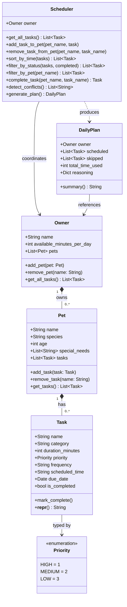

# PawPal+ Project Reflection

## 1. System Design

**a. Initial design**

1. **Set up a pet profile** — The user enters basic information about themselves and their pet (owner name, pet name, pet type, and available time per day). This gives the scheduler the constraints it needs to build a realistic plan.

2. **Add and manage care tasks** — The user creates tasks such as walks, feeding, medication, grooming, or enrichment. Each task has at minimum a name, an estimated duration, and a priority level. The user can also edit or remove tasks as the pet's needs change.

3. **Generate and review a daily schedule** — The user asks the app to produce a daily care plan. The scheduler fits tasks into the owner's available time window, ordered by priority. The app displays the resulting plan and explains why tasks were included, deferred, or skipped, so the owner understands the reasoning.

**UML Class Diagram (Mermaid.js):**

The initial design has five classes organized around a central `Scheduler` that coordinates all the other objects.

- **`Owner`** — a data-only class that holds the owner's name and how many minutes per day they have available for pet care. It represents the time constraint the scheduler must respect.

- **`Pet`** — a data-only class that stores the pet's name, species, age, and any special needs (e.g. "needs medication twice daily"). It gives the scheduler context about who is being cared for.

- **`Task`** — represents a single care activity. It holds the task name, category (walk, feed, meds, grooming, enrichment), estimated duration in minutes, priority level (high/medium/low), and whether it has been completed. It can mark itself complete and produce a readable string description.

- **`Scheduler`** — the central coordinator. It owns an `Owner`, a `Pet`, and a list of `Task` objects. Its job is to accept new tasks, remove tasks by name, and run `generate_plan()` which applies the scheduling logic and returns a `DailyPlan`.

- **`DailyPlan`** — the output of scheduling. It holds two lists (scheduled tasks and skipped tasks), the total time used, and a reasoning dictionary that maps each skipped task to the reason it was left out. Its `summary()` method produces a human-readable explanation of the plan.

**b. Design changes**

After reviewing the skeleton, four changes were made based on identified gaps:

1. **Added a `Priority` enum instead of a plain string.**
   The original design used `priority: str`, which meant values like `"high"`, `"High"`, and `"urgent"` were all silently valid. When `generate_plan()` sorts tasks by priority it needs consistent, comparable values. Replacing the string with a `Priority(Enum)` with members `HIGH = 1`, `MEDIUM = 2`, `LOW = 3` makes sorting unambiguous and catches bad values at assignment time rather than silently at runtime.

2. **Added `owner` and `pet` fields to `DailyPlan`.**
   `DailyPlan` had no reference to who the plan was for. Without this, `summary()` could not include context like the pet's name or the owner's available time. Passing `owner` and `pet` into `DailyPlan` at construction time gives the output object everything it needs to produce a complete, readable summary.

3. **Gave `generate_plan()` a safe placeholder return.**
   The stub returned `None` implicitly, meaning any code that called `plan.scheduled` before the method was implemented would raise an `AttributeError`. Returning `DailyPlan(owner=self.owner, pet=self.pet)` makes the skeleton safely runnable end-to-end even before the scheduling logic is filled in.

4. **Implemented duplicate-checking in `add_task()` and first-match removal in `remove_task()`.**
   Without a uniqueness check, the same task name could be added twice, making removal ambiguous. `add_task()` now raises a `ValueError` if a task with that name already exists. `remove_task()` removes the first match and raises `ValueError` if no match is found, making the behavior explicit rather than silently doing nothing.

---

## 2. Scheduling Logic and Tradeoffs

**a. Constraints and priorities**

The scheduler considers two hard constraints and one soft constraint:

1. **Time budget (hard)** — `Owner.available_minutes_per_day` is a firm ceiling. Any task whose `duration_minutes` exceeds the remaining time is skipped, no matter its priority. This reflects reality: an owner who has 60 minutes cannot do a 90-minute grooming session regardless of how important it is.

2. **Completion status (hard)** — Tasks already marked `is_completed = True` are always skipped and recorded with the reason `"already completed"`. Re-scheduling a task the owner has already done would be misleading.

3. **Priority level (soft)** — `Priority.HIGH` tasks are scheduled before `Priority.MEDIUM` and `Priority.LOW` ones. Within the same priority tier, shorter tasks are scheduled first to maximise the number of tasks that fit before the budget runs out. Priority is a soft constraint because a lower-priority task that fits may still be scheduled if there is time remaining after all higher-priority tasks have been processed.

The time budget was treated as the most important constraint because it is the only one that comes from the real world rather than the data model. A pet owner's available time is non-negotiable; priority and completion status are both things the owner controls.

**b. Tradeoffs**

**Tradeoff 1: greedy time-budget fill vs. optimal packing**

The scheduler uses a greedy algorithm: it sorts all tasks by priority (then frequency urgency, then duration) and fills the owner's time budget in that order, stopping as soon as a task won't fit. It never backtracks or tries rearranging tasks to squeeze in a better combination.

*Example of the problem:* Suppose 25 minutes remain and the next task needs 30 minutes. The scheduler skips it and stops — even if two lower-priority tasks totaling 20 minutes would have fit perfectly. A true optimal packing algorithm (like 0/1 knapsack) would find that combination, but it requires evaluating every possible subset of remaining tasks.

*Why the greedy approach is reasonable here:* For a daily pet care app, pet owners generally want the most important tasks done first, not a mathematically optimal packing of their remaining minutes. A walk and medication being scheduled before grooming reflects real-world priority, even if it leaves some time unused. The greedy approach also runs instantly regardless of how many tasks are added, whereas knapsack solutions grow exponentially with the number of items. Simplicity and predictability matter more than squeezing out the last few minutes of a pet owner's day.

*What this tradeoff costs:* Available time can be left unused when a cluster of small low-priority tasks would have fit after a large high-priority task was skipped. A future improvement could add a "fill remaining minutes" pass after the main greedy loop to schedule smaller pending tasks into leftover time.

---

**Tradeoff 2: exact time-slot matching vs. overlap detection**

`detect_conflicts()` flags two tasks as conflicting only when their `scheduled_time` strings are **exactly equal** (e.g., both at `"07:00"`). It does not check whether one task's duration extends into the next task's start time.

*Example of what gets missed:* A 30-minute walk starting at `07:00` runs until `07:30`. A feeding task at `07:15` genuinely overlaps with it — but `detect_conflicts()` reports no conflict because `"07:00" != "07:15"`.

*Why exact matching is the right first step:* True overlap detection requires converting every `"HH:MM"` string to minutes-since-midnight, adding `duration_minutes`, and checking for range intersections across every pair of tasks — an O(n²) comparison. For a small daily task list (typically under 20 items) this is fast enough, but it is significantly more code to write, test, and explain. Exact matching catches the most common user mistake (accidentally setting two tasks to the same start time) with a simple, readable `defaultdict` grouping that is easy to verify at a glance.

*What this tradeoff costs:* Back-to-back tasks where the first runs long enough to overlap the second are silently allowed. A future improvement would parse `scheduled_time` into `datetime` objects and compare `(start, start + duration)` intervals — a natural next step once the core scheduling logic is solid.

---

## 3. AI Collaboration

**a. How you used AI**

AI tools (VS Code Copilot and Claude Code) were used in four distinct ways across the project phases:

1. **UML and design review** — After drafting the initial class diagram, Copilot Chat was asked `"Based on my final implementation, what updates should I make to my initial UML diagram?"` with `#file:pawpal_system.py` attached. It caught that `Owner` and `Pet` were missing their method lists entirely, that `Task` was missing `frequency`, `scheduled_time`, and `due_date`, and that the `Scheduler` still listed a phantom `pet` attribute it no longer held. These were structural gaps that would have made the UML misleading as documentation.

2. **Test planning** — Starting a fresh Copilot Chat session and asking `"What are the most important edge cases to test for a pet scheduler with sorting and recurring tasks?"` produced a prioritised list that included the same-pet conflict scenario and the double-complete chain — two cases that were not in the initial test plan but turned out to expose real behaviour worth pinning down.

3. **Test code generation** — Copilot's Generate Tests action on `pawpal_system.py` produced a first draft of the AAA-structured test functions. The drafts needed editing (see section b), but they provided the scaffold so test-writing time was spent on logic rather than boilerplate.

4. **Debugging and refactoring** — When the `detect_conflicts` expander logic in `app.py` produced a malformed time string, Copilot suggested the correct string-split approach in inline chat without needing to leave the editor.

The prompts that worked best were **specific and scoped**: attaching the exact file with `#file:`, naming the method being tested, and asking for one thing at a time. Broad prompts like `"improve my scheduler"` produced generic suggestions that did not fit the existing design.

**b. Judgment and verification**

**Suggestion rejected: adding a `pet` reference to `DailyPlan`**

During test generation, Copilot drafted a test that called `plan.pet.name` to assert which pet's tasks were scheduled. This implied `DailyPlan` should hold a `pet` attribute — which the original skeleton had listed but the actual implementation removed, because an owner can have multiple pets and a single plan covers all of them. Accepting that suggestion would have meant either reverting a deliberate design decision or silently breaking the multi-pet case.

The suggestion was rejected by reading `DailyPlan` in `pawpal_system.py` directly and confirming the field did not exist. The test was rewritten to check `plan.scheduled` task names instead of navigating through a pet reference. This also turned out to be a better test — it verified the scheduling outcome rather than an object relationship.

**How AI suggestions were evaluated in general:** every generated function was run through `pytest` before being committed. If a test passed for the wrong reason (e.g., an assertion that was trivially true regardless of behaviour), it was rewritten. If a suggestion introduced a new import or helper that wasn't needed elsewhere, it was removed. The rule was: AI drafts the shape, human verifies the logic.

---

## 4. Testing and Verification

**a. What you tested**

The final suite has 34 tests across seven sections. The five most important behaviours and the reason each one needed a test:

1. **Priority ordering in `generate_plan`** — the scheduler's core promise is that HIGH tasks come before LOW ones. If sorting by `priority.value` regressed, nothing in the UI would show the bug; only a test that adds LOW before HIGH and checks the scheduled order would catch it.

2. **Time-budget boundary (`duration == remaining`)** — the condition in `generate_plan` is `<=`, not `<`. An off-by-one error here would silently drop tasks that fit exactly, which is the worst kind of bug: no crash, just a missing task. The boundary test (`Walk 30 min + Feeding 30 min` in a 60-minute budget) pins this contract.

3. **Daily recurrence date arithmetic** — `complete_task` uses `timedelta(days=1)`. A fixed reference date (`date(2026, 4, 1)`) is used so the test is not affected by when it runs. Without this, a bug in the `timedelta` calculation could go unnoticed until a real user's task was scheduled a day late.

4. **Conflict detection — same-pet case** — `detect_conflicts` groups by `scheduled_time` across all pets. The same-pet test confirms it also catches two tasks on the same pet at the same time, not just cross-pet clashes. This is the less obvious path through the code.

5. **`filter_by_pet` case insensitivity** — the `.lower()` comparison in `Scheduler.filter_by_pet` is easy to accidentally remove during refactoring. The test with `"biscuit"` matching `"Biscuit"` keeps that guarantee visible.

**b. Confidence**

**4 / 5** — all 34 tests pass, covering happy paths, boundary conditions, and the main edge cases. The missing star reflects one known gap: `detect_conflicts` only flags exact start-time matches. A 30-minute task at `07:00` that overlaps a task at `07:15` is not caught. This is a documented tradeoff (see Section 2b, Tradeoff 2), not an oversight in test coverage — but it means the scheduler can produce a plan with a real scheduling conflict that no test will flag.

Edge cases to test next with more time:
- **Duration overlap detection** — parse `scheduled_time` to minutes, add `duration_minutes`, and check for `(start, end)` interval intersections.
- **Owner with multiple pets, same task name** — two pets can each have a task called `"Walk"`. `complete_task` on one should not touch the other.
- **`generate_plan` across midnight** — tasks at `"23:30"` and `"00:15"` sort incorrectly under lexicographic comparison since `"00:15" < "23:30"`. No current test covers this.

---

## 5. Reflection

**a. What went well**

The part of this project I'm most satisfied with is the separation between the scheduling logic and the UI. Every algorithm — sorting, conflict detection, recurrence, plan generation — lives in `pawpal_system.py` and is independently testable. `app.py` only calls into that layer; it contains no scheduling logic of its own. This meant the 34-test suite could be written and run without Streamlit being installed, and the UI could be redesigned without touching the algorithms. That boundary was a deliberate design decision and it paid off at every later phase.

**b. What you would improve**

Two things stand out:

1. **Conflict detection** should be upgraded from exact start-time matching to duration-aware interval overlap. The current implementation catches the most obvious user mistakes but silently misses back-to-back tasks that genuinely overlap. Switching to `(start_minutes, start_minutes + duration)` interval comparison is a contained change that would not affect any other method.

2. **The Streamlit UI only supports one pet per session.** The setup form creates one owner and one pet, and there is no way to add a second pet through the UI even though `Owner.add_pet()` fully supports it in the backend. A future iteration would replace the single pet form with a multi-pet panel — a list of registered pets with an "Add another pet" button.

**c. Key takeaway**

The most important thing I learned is that **AI tools are most useful when you already know what you want and are specific about it** — and most risky when you let them define the design for you.

When I asked Copilot `"generate tests for this file"` with no further context, it produced functions that technically passed but tested the wrong things (like asserting object identity rather than behaviour). When I asked `"write a test that proves completing a daily task creates a new task due exactly one day later, using a fixed reference date"`, the result was immediately usable.

The same principle applied to the UML and architecture decisions. AI suggested adding a `pet` field to `DailyPlan`, which matched the original skeleton but contradicted the multi-pet design that had already been implemented. Accepting that suggestion without reading the code would have introduced a bug. The lesson is: **AI accelerates execution but does not replace understanding**. Every suggestion needs to be evaluated against the design you are building, not the design the AI assumes you have.
