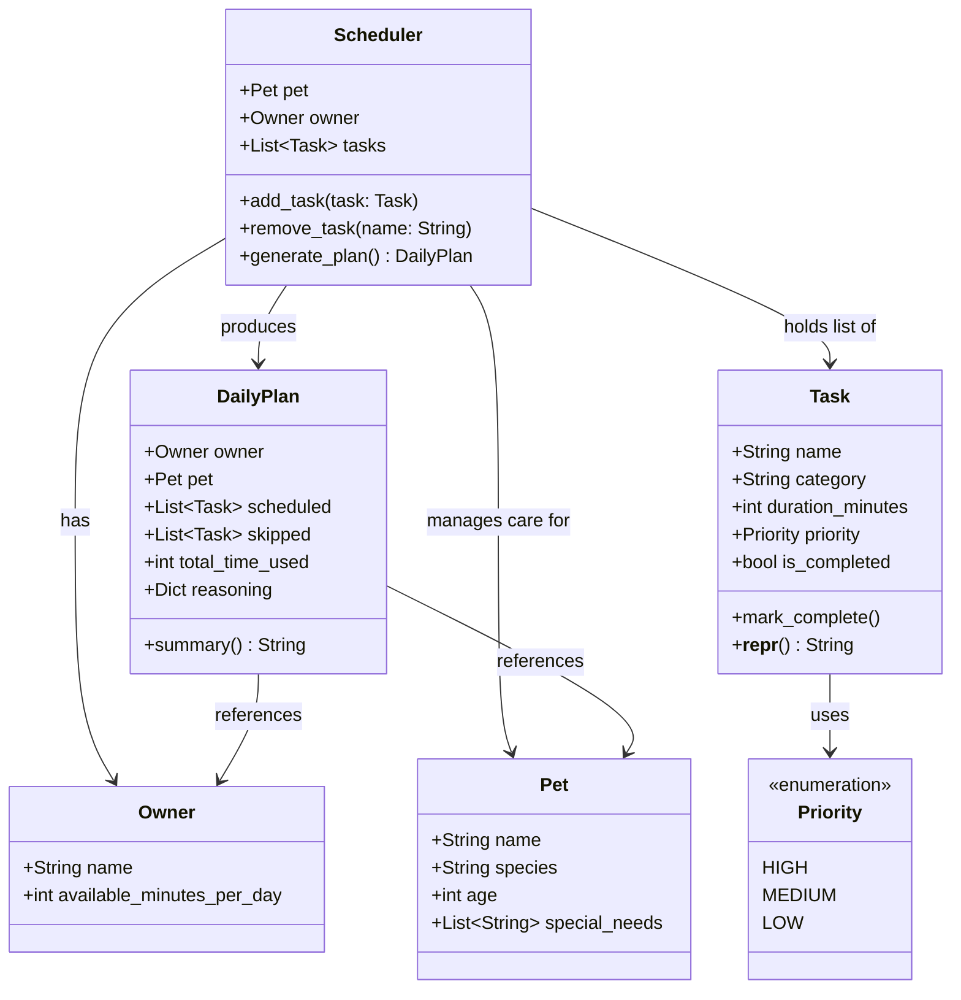

# PawPal+ Project Reflection

## 1. System Design

**a. Initial design**

1. **Set up a pet profile** — The user enters basic information about themselves and their pet (owner name, pet name, pet type, and available time per day). This gives the scheduler the constraints it needs to build a realistic plan.

2. **Add and manage care tasks** — The user creates tasks such as walks, feeding, medication, grooming, or enrichment. Each task has at minimum a name, an estimated duration, and a priority level. The user can also edit or remove tasks as the pet's needs change.

3. **Generate and review a daily schedule** — The user asks the app to produce a daily care plan. The scheduler fits tasks into the owner's available time window, ordered by priority. The app displays the resulting plan and explains why tasks were included, deferred, or skipped, so the owner understands the reasoning.

**UML Class Diagram (Mermaid.js):**

The initial design has five classes organized around a central `Scheduler` that coordinates all the other objects.

- **`Owner`** — a data-only class that holds the owner's name and how many minutes per day they have available for pet care. It represents the time constraint the scheduler must respect.

- **`Pet`** — a data-only class that stores the pet's name, species, age, and any special needs (e.g. "needs medication twice daily"). It gives the scheduler context about who is being cared for.

- **`Task`** — represents a single care activity. It holds the task name, category (walk, feed, meds, grooming, enrichment), estimated duration in minutes, priority level (high/medium/low), and whether it has been completed. It can mark itself complete and produce a readable string description.

- **`Scheduler`** — the central coordinator. It owns an `Owner`, a `Pet`, and a list of `Task` objects. Its job is to accept new tasks, remove tasks by name, and run `generate_plan()` which applies the scheduling logic and returns a `DailyPlan`.

- **`DailyPlan`** — the output of scheduling. It holds two lists (scheduled tasks and skipped tasks), the total time used, and a reasoning dictionary that maps each skipped task to the reason it was left out. Its `summary()` method produces a human-readable explanation of the plan.

**b. Design changes**

After reviewing the skeleton, four changes were made based on identified gaps:

1. **Added a `Priority` enum instead of a plain string.**
   The original design used `priority: str`, which meant values like `"high"`, `"High"`, and `"urgent"` were all silently valid. When `generate_plan()` sorts tasks by priority it needs consistent, comparable values. Replacing the string with a `Priority(Enum)` with members `HIGH = 1`, `MEDIUM = 2`, `LOW = 3` makes sorting unambiguous and catches bad values at assignment time rather than silently at runtime.

2. **Added `owner` and `pet` fields to `DailyPlan`.**
   `DailyPlan` had no reference to who the plan was for. Without this, `summary()` could not include context like the pet's name or the owner's available time. Passing `owner` and `pet` into `DailyPlan` at construction time gives the output object everything it needs to produce a complete, readable summary.

3. **Gave `generate_plan()` a safe placeholder return.**
   The stub returned `None` implicitly, meaning any code that called `plan.scheduled` before the method was implemented would raise an `AttributeError`. Returning `DailyPlan(owner=self.owner, pet=self.pet)` makes the skeleton safely runnable end-to-end even before the scheduling logic is filled in.

4. **Implemented duplicate-checking in `add_task()` and first-match removal in `remove_task()`.**
   Without a uniqueness check, the same task name could be added twice, making removal ambiguous. `add_task()` now raises a `ValueError` if a task with that name already exists. `remove_task()` removes the first match and raises `ValueError` if no match is found, making the behavior explicit rather than silently doing nothing.

---

## 2. Scheduling Logic and Tradeoffs

**a. Constraints and priorities**

- What constraints does your scheduler consider (for example: time, priority, preferences)?
- How did you decide which constraints mattered most?

**b. Tradeoffs**

**Tradeoff 1: greedy time-budget fill vs. optimal packing**

The scheduler uses a greedy algorithm: it sorts all tasks by priority (then frequency urgency, then duration) and fills the owner's time budget in that order, stopping as soon as a task won't fit. It never backtracks or tries rearranging tasks to squeeze in a better combination.

*Example of the problem:* Suppose 25 minutes remain and the next task needs 30 minutes. The scheduler skips it and stops — even if two lower-priority tasks totaling 20 minutes would have fit perfectly. A true optimal packing algorithm (like 0/1 knapsack) would find that combination, but it requires evaluating every possible subset of remaining tasks.

*Why the greedy approach is reasonable here:* For a daily pet care app, pet owners generally want the most important tasks done first, not a mathematically optimal packing of their remaining minutes. A walk and medication being scheduled before grooming reflects real-world priority, even if it leaves some time unused. The greedy approach also runs instantly regardless of how many tasks are added, whereas knapsack solutions grow exponentially with the number of items. Simplicity and predictability matter more than squeezing out the last few minutes of a pet owner's day.

*What this tradeoff costs:* Available time can be left unused when a cluster of small low-priority tasks would have fit after a large high-priority task was skipped. A future improvement could add a "fill remaining minutes" pass after the main greedy loop to schedule smaller pending tasks into leftover time.

---

**Tradeoff 2: exact time-slot matching vs. overlap detection**

`detect_conflicts()` flags two tasks as conflicting only when their `scheduled_time` strings are **exactly equal** (e.g., both at `"07:00"`). It does not check whether one task's duration extends into the next task's start time.

*Example of what gets missed:* A 30-minute walk starting at `07:00` runs until `07:30`. A feeding task at `07:15` genuinely overlaps with it — but `detect_conflicts()` reports no conflict because `"07:00" != "07:15"`.

*Why exact matching is the right first step:* True overlap detection requires converting every `"HH:MM"` string to minutes-since-midnight, adding `duration_minutes`, and checking for range intersections across every pair of tasks — an O(n²) comparison. For a small daily task list (typically under 20 items) this is fast enough, but it is significantly more code to write, test, and explain. Exact matching catches the most common user mistake (accidentally setting two tasks to the same start time) with a simple, readable `defaultdict` grouping that is easy to verify at a glance.

*What this tradeoff costs:* Back-to-back tasks where the first runs long enough to overlap the second are silently allowed. A future improvement would parse `scheduled_time` into `datetime` objects and compare `(start, start + duration)` intervals — a natural next step once the core scheduling logic is solid.

---

## 3. AI Collaboration

**a. How you used AI**

- How did you use AI tools during this project (for example: design brainstorming, debugging, refactoring)?
- What kinds of prompts or questions were most helpful?

**b. Judgment and verification**

- Describe one moment where you did not accept an AI suggestion as-is.
- How did you evaluate or verify what the AI suggested?

---

## 4. Testing and Verification

**a. What you tested**

- What behaviors did you test?
- Why were these tests important?

**b. Confidence**

- How confident are you that your scheduler works correctly?
- What edge cases would you test next if you had more time?

---

## 5. Reflection

**a. What went well**

- What part of this project are you most satisfied with?

**b. What you would improve**

- If you had another iteration, what would you improve or redesign?

**c. Key takeaway**

- What is one important thing you learned about designing systems or working with AI on this project?
